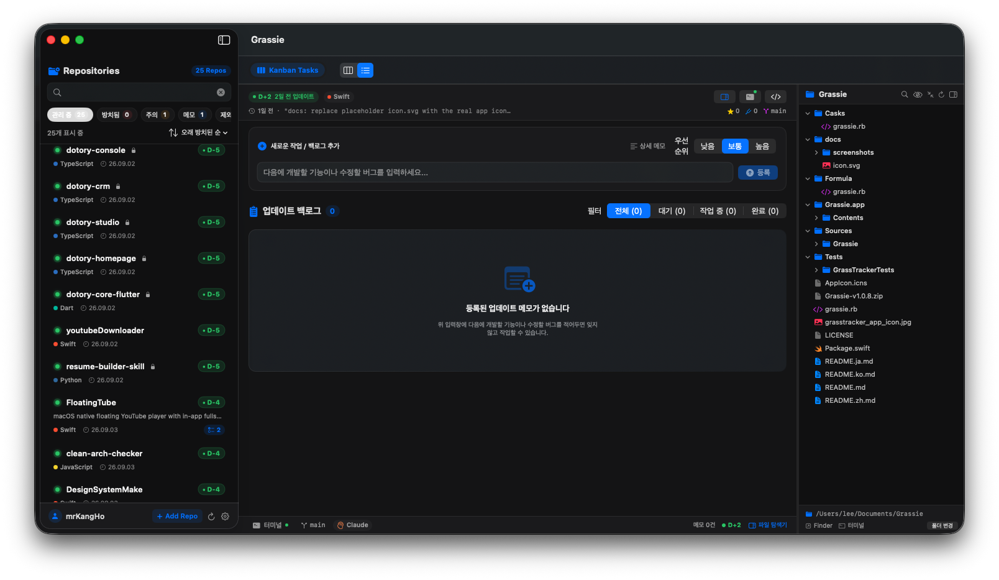

<p align="center">
  
</p>

<h1 align="center">Fleet (macOS)</h1>

<p align="center">
  <a href="README.md">🇰🇷 한국어</a> | <a href="README.en.md">🇺🇸 English</a> | <b>🇯🇵 日本語</b> | <a href="README.zh.md">🇨🇳 中文</a>
</p>

> **GitHubリポジトリの放置日数を追跡し、更新アイデアをメモ管理するmacOSネイティブアプリ**

Fleetは、GitHubのすべてのリポジトリを取得して最終コミットからの経過日数（`D+XX`）を追跡し、リポジトリごとに次に開発したい機能やアイデアをメモできる、クリーンアーキテクチャベースのmacOSアプリです。

<p align="center">
  
</p>

---

## 🌟 主な機能

1. **GitHub全リポジトリ同期**
   - Personal Access Token（PAT）によるPublic/Private全リポジトリの取得
   - 最終コミット／プッシュ日時とコミットメッセージのリアルタイム取得
   - 言語、スター数、フォーク数、オープンイシュー数の表示
2. **管理リポジトリの選択＆リスト編集（NEW ⭐️）**
   - **初期リポジトリ選択ウィザード**: GitHubリポジトリを初めて取得する際にポップアップするシートで、実際に管理・追跡するリポジトリをチェックボックスで直接選択
   - **いつでもリスト編集**: サイドバー上部の**`[リスト編集]`**ボタンから、管理リポジトリのリストをいつでも再チェック／解除可能
   - **リポジトリの右クリックメニュー**: 個別のリポジトリを右クリックして**「このリポジトリをモニタリング対象から除外（非表示）」**または**「再度モニタリングに含める」**を即座に設定
   - 管理から除外されたリポジトリは、Dockバッジの件数カウントおよびシステム通知から完全に除外され、不要な通知を防止
3. **放置日数（Stale Days）とリスクの可視化**
   - 🟢 **正常（Active）**: 最近活動中
   - 🟡 **注意（Warning）**: 設定した注意期間を超過（デフォルト14日）
   - 🔴 **放置（Stale）**: 設定した放置期間を超過（デフォルト30日、`D+XX`バッジを表示）
4. **リポジトリごとの更新メモ＆ロードマップ管理**
   - サイドバーでリポジトリをクリックすると、右側のメイン画面に該当リポジトリのメモ履歴が表示
   - タイトル、詳細内容、優先度を設定できるクイックインラインメモ追加
   - メモの完了チェックボックスおよび削除機能に対応
   - ローカルの`Application Support`にJSON形式で安全に永続保存
5. **AI Agent CLIによるワンクリック作業実行（NEW 🚀）**
   - メモカードの**`[ 🚀 作業実行 (AI) ]`**ボタンをクリックすると、設定済みのAI Agent CLI（Google `agy`、`claude`、`aider`など）でターミナルを開き、自動的に作業を開始
   - ローカルリポジトリフォルダの自動検出と手動フォルダ連携に対応
   - リポジトリ名、言語、ブランチ、メモのタイトル／内容を組み合わせたスマートプロンプトを自動生成
   - AIプロンプトのクリップボードへのワンクリックコピーに対応
   - メモのステータスを`待機中`→`作業中 🚀`にリアルタイムで追跡し、最終実行日時を記録
6. **macOSネイティブ連携（Dockバッジ＆システム通知）**
   - 設定した基準日（デフォルト30日）を超えた**放置リポジトリの総数をmacOS Dockアイコンのバッジ**として表示
   - 放置リポジトリが発生した際にmacOSシステムバナー通知
7. **環境設定（Cmd + ,）**
   - GitHub Personal Access Tokenの登録とリアルタイム連携テスト
   - AI Agent CLIプリセットの選択（`agy`、`claude`、`aider`、カスタム）とテンプレート設定
   - 放置／注意判定基準日のスライダー
   - DockバッジおよびシステムのOn/Offトグル
   - アーカイブ済み（Archived）リポジトリおよびフォーク（Fork）リポジトリのフィルタリングオプション
8. **多言語対応（i18n、NEW 🌐）**
   - 韓国語／English／日本語／中文（簡体）の4言語に完全対応
   - 環境設定 > 一般タブから、システム言語とは独立してアプリの表示言語を選択可能
   - macOSのシステム言語にそのまま従う「システム言語」オプションにも対応

---

## 🏛️ クリーンアーキテクチャ（Clean Architecture）設計

Fleetは、関心の分離とテスト容易性を最大化するため、クリーンアーキテクチャの3層構造を厳格に遵守しています。

```
Sources/Fleet/
├── App/
│   ├── FleetApp.swift           # アプリのエントリーポイント（WindowGroup + MenuBarExtra）
│   └── AppEnvironment.swift           # DI（依存性注入）コンテナ — Data実装を組み立てる唯一の場所
├── Domain/                             # 純粋なビジネスロジック（外部フレームワーク／Data／Presentationに非依存）
│   ├── Entities/
│   │   ├── RepositoryItem.swift       # リポジトリエンティティ
│   │   ├── MemoItem.swift             # メモエンティティ
│   │   ├── StaleStatus.swift          # 放置ステータスとD+dayバッジの計算
│   │   ├── AppSettings.swift          # アプリ環境設定エンティティ
│   │   └── AppLanguage.swift          # 表示言語エンティティ（System/ko/en/ja/zh-Hans）
│   ├── Repositories/                  # プロトコルインターフェース（境界、Dataが実装）
│   │   ├── GitHubRepositoryProtocol.swift
│   │   ├── MemoRepositoryProtocol.swift
│   │   ├── SettingsRepositoryProtocol.swift
│   │   ├── LocalPathRepositoryProtocol.swift
│   │   └── TerminalExecutionServiceProtocol.swift
│   └── UseCases/                      # ユースケース（プロトコルのみを注入される純粋なロジック）
│       ├── FetchRepositoriesUseCase.swift
│       ├── CalculateStaleStatusUseCase.swift
│       ├── ManageMemoUseCase.swift
│       ├── ExecuteAgentTaskUseCase.swift
│       ├── UpdateDockBadgeUseCase.swift
│       └── ScheduleNotificationUseCase.swift
├── Data/                              # 通信および永続化の実装（Domainのプロトコルを実装）
│   ├── DataSources/
│   │   ├── GitHub/ (GitHubAPIService, GitHubDTOs)
│   │   ├── Persistence/ (LocalMemoStorage Actor)
│   │   └── System/ (DockBadgeManager, NotificationManager, TerminalExecutionService)
│   └── Repositories/
│       ├── GitHubRepositoryImpl.swift
│       ├── MemoRepositoryImpl.swift
│       ├── SettingsRepositoryImpl.swift
│       └── LocalPathRepositoryImpl.swift
├── Presentation/                      # SwiftUI + MVVM — DomainのUseCase／Protocolのみを参照
│   ├── ViewModels/
│   │   ├── RepositoryListViewModel.swift
│   │   ├── RepositoryDetailViewModel.swift
│   │   ├── MenuBarViewModel.swift      # メニューバーポップオーバー専用の状態／ロジック（Viewから直接UseCaseを呼び出さない）
│   │   ├── SettingsViewModel.swift
│   │   └── TerminalSessionManager.swift
│   ├── Theme/ (AppTheme — 色／スプリングアニメーション／ボタンスタイルのトークン)
│   └── Views/
│       ├── MainSplitView.swift        # 2ペインスプリットレイアウト＋上部ナビゲーションバー
│       ├── MenuBar/ (MenuBarExtraView)
│       ├── Sidebar/ (SidebarView, RepositoryRowView, RepositorySelectionSheet)
│       ├── Detail/ (RepositoryDetailView, MemoTimelineView, MemoDetailModalView, FileTreeSidebarView)
│       ├── Dashboard/ (RepoHealthDashboardView, AgentWorkflowsView, CliEnvironmentsView)
│       ├── Terminal/ (VSCodeTerminalPanelView)
│       └── Settings/ (SettingsView)
└── Resources/                         # 多言語リソース
    ├── ko.lproj/Localizable.strings
    ├── en.lproj/Localizable.strings
    ├── ja.lproj/Localizable.strings
    └── zh-Hans.lproj/Localizable.strings
```

**依存関係ルール（Dependency Rule）の検証**: `Presentation`と`Data`は、`Domain`のEntity／UseCase／Protocolのみを参照し、互いを直接参照することはありません。Data実装（`GitHubRepositoryImpl`など）は`App/AppEnvironment.swift`の1か所でのみ組み立てられて注入され、Viewがこれを直接インスタンス化することはありません。

---

## 🍺 Homebrewでインストール

このリポジトリ自体をHomebrewのタップ（tap）として使用します — 別途`homebrew-*`リポジトリを作る必要はありません。

```bash
brew tap mrKangHo/fleet https://github.com/mrKangHo/Fleet.git
brew install --cask fleet
```

> ⚠️ Fleetはまだコード署名（code signing）と公証（notarization）がされていません。初回起動時にmacOSがアプリをブロックした場合は、Finderで Fleet.app を右クリックして「開く」を選択するか、`xattr -cr /Applications/Fleet.app` を実行してください。現時点ではApple Silicon（arm64）のみ対応しています。

---

## 🚀 ビルド＆実行方法

### 1. Xcodeでプロジェクトを開く（推奨）
```bash
open Fleet.xcodeproj
```

### 2. テストの実行
```bash
DEVELOPER_DIR=/Applications/Xcode.app/Contents/Developer xcrun swift test
```

### 3. macOSアプリバンドルのビルドと直接実行
```bash
./scripts/build_app.sh
open Fleet.app
```

---

## 🔑 GitHub Tokenの権限ガイド
非公開リポジトリを含むすべてのリポジトリを取得するには、GitHub PAT作成時に以下の権限が必要です:
- **`repo`**（Full control of private repositories）
